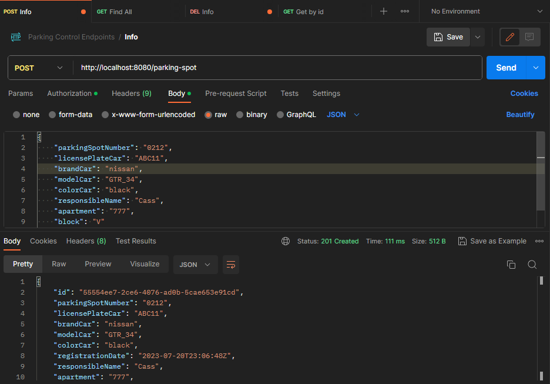
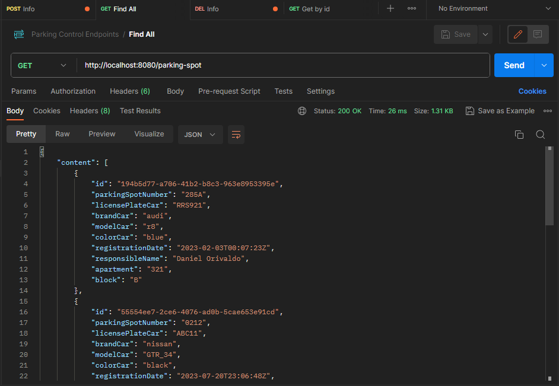
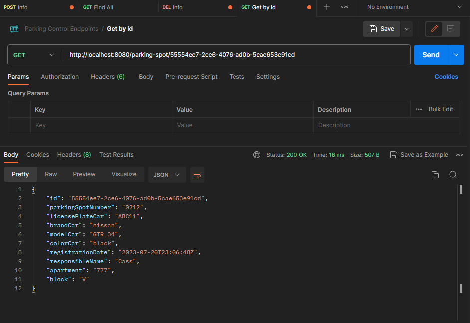
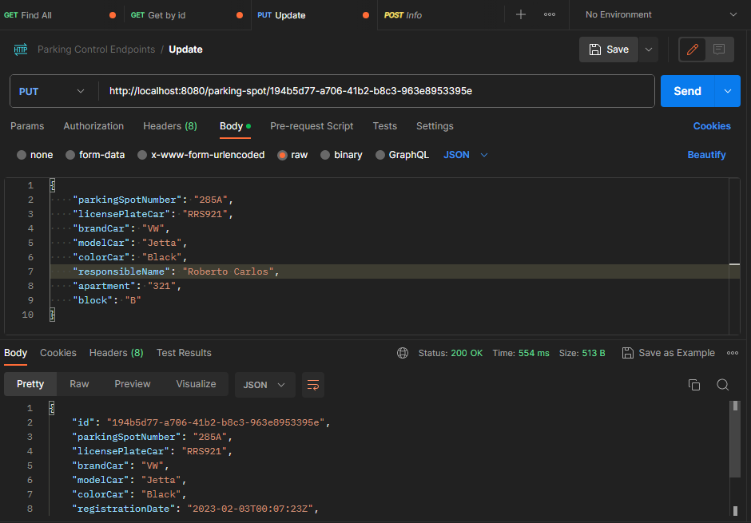
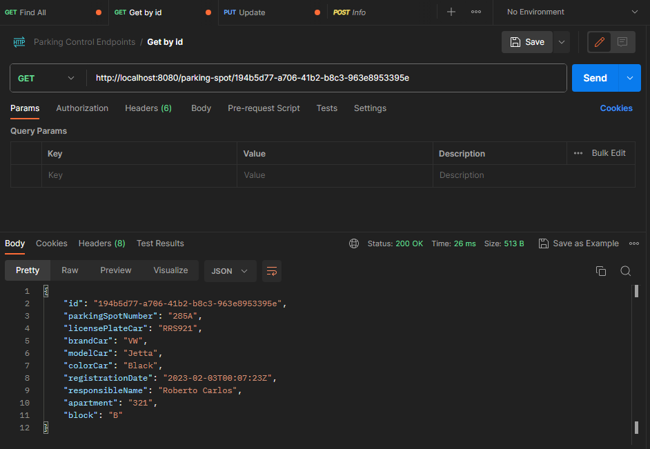
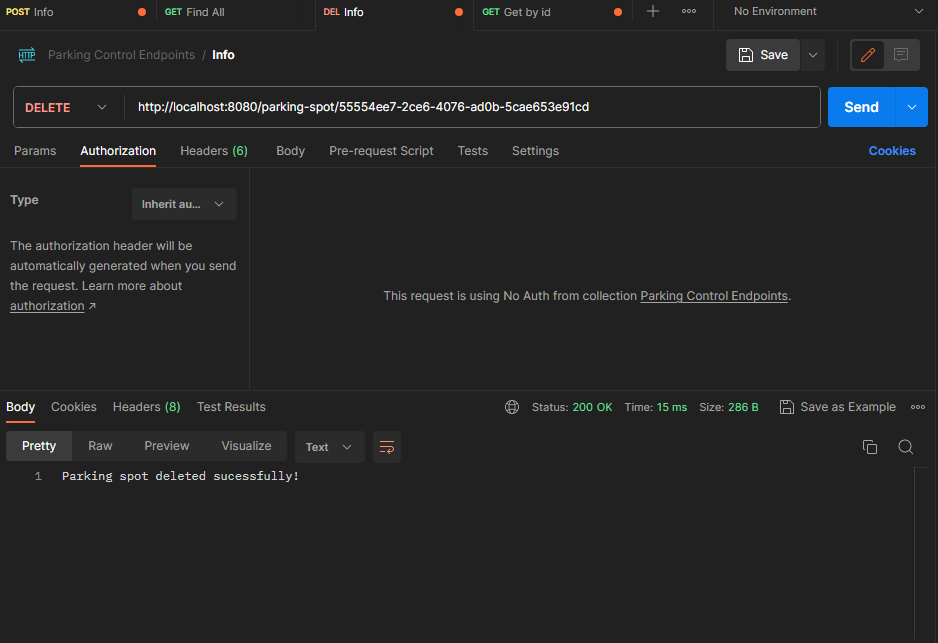
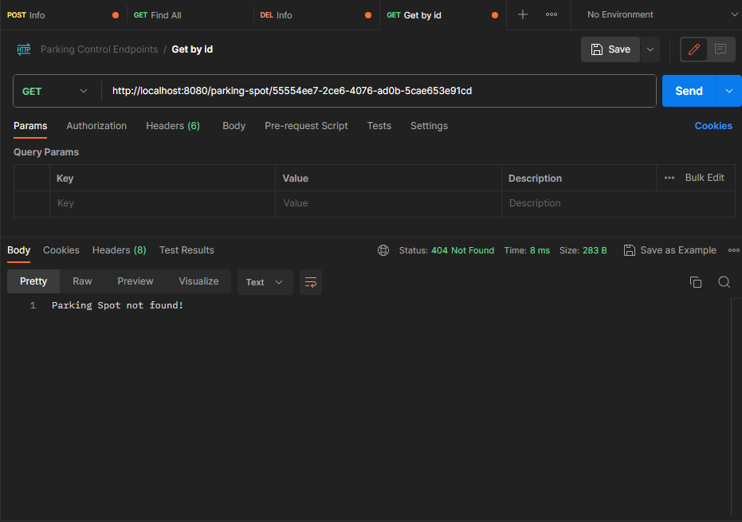

<h1 align="center"> Parking Spot  </h1>

A simple application using Java and Spring 

  <a href="#-tecnologies">Tecnologies</a>&nbsp;&nbsp;&nbsp;|&nbsp;&nbsp;&nbsp;
  <a href="#-project">Project</a>&nbsp;&nbsp;&nbsp;|&nbsp;&nbsp;&nbsp;
  <a href="#memo-license">License</a>

 

## 🚀 Tecnologies

This project was developed with the following technologies:

- Java & Spring framework 🍃
- Postgres 🐘
- Git & Github 
- Postman

## 💻 Project

The Parking Spot is an application responsible for implementing a CRUD along with validations to simulate a registration in a parking space.

## :memo: License

This project is under license from MIT

 

## Endpoints 📡

 

### GET 
  - All info about the registered spots:

  

 

###  GET 
 - By id (all info about a single spot):

  

 

### POST 
  - Register a spot:

  

 
 

### Update ⚙ (PUT):
  - Updating by id:

  

 

  - Querying after update:

  

 

### Delete ❌:
  - Deleting by id:

  

 

  - Querying after delete:

  

